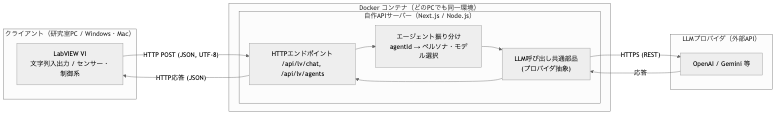
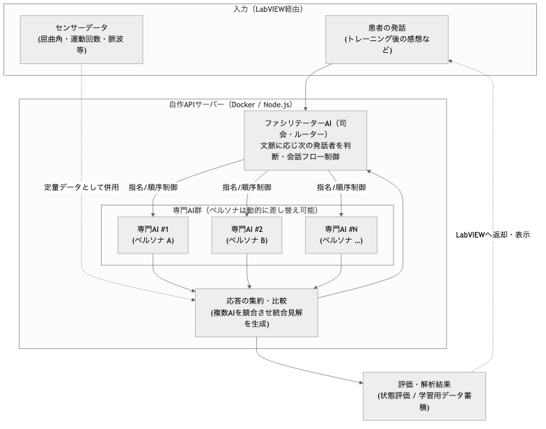
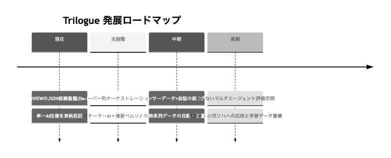

# Trilogue システム構成資料（As-Is / To-Be）

> 目的: 本システムの現状（As-Is）と、今後構築するマルチエージェント対話システム（To-Be）の
> 全体像・データフローを可視化し、研究室での共有および中間発表のたたき台とする。
> 最終更新: 2026-07-13 各図に一般向けの要約（「要するに」）を追加。
>
> **本資料の読み方**：各図には冒頭に **📌「要するに」（専門知識がなくても分かる説明）** を置き、
> その後に **技術的な詳細** を記載しています。まず「要するに」だけ追えば全体像がつかめます。

---

## 1. プロジェクトの最終ビジョン

リハビリテーション評価を、従来の統計的手法（FMA・BRS等）だけでなく
**電子的に取得したセンサーデータ**で定量的・自動的に行えるようにする。

- **取得データ例**: 指の屈曲角、運動回数、生体データ（脈波などによる自律神経・精神状態）
- **狙い**: センサーデータ × LLM により、患者状態を自動評価し、**パーソナライズされたトレーニング**を提案
- **そのための土台**: トレーニング後に患者が感想を話し、**複数の生成AIが競合・統合**して見解を出す
  「会話型の評価システム」。将来の学習データを貯める器でもある。
- 引き出したいのは「指が動くようになったか」「続けたいか」「頑張る気が出たか」といった
  **人間臭い主観**。心理学・統計に寄せすぎず、まずは自然な対話として実現する。

---

## 2. As-Is：現状のシステム構成（実装済み）

> 📌 **要するに**：LabVIEW（計測・操作の画面）に打ち込んだ文章を、**間に立つサーバーがAIへ橋渡し**し、
> AIの返事を受け取って画面に持ち帰る仕組みです。いわば **「人とAIをつなぐ専用の“電話交換台”」**。
> 現状は **“1人のAIと1往復の会話”が実機で動作済み** です。
>
> *（技術的に言うと）* LabVIEW を HTTP クライアント、Docker 上の自作APIサーバーを LLM ブリッジとし、
> 外部LLMへ HTTPS で中継する構成。1対1の往復が動作済み。

**現状のポイント**
- LabVIEW ⇄ サーバー：**HTTP / JSON**（同一PCでも別PC=同一LANでも可）
- サーバー ⇄ LLM：**HTTPS / REST**。APIキーはサーバー内のみ保持しLVへ渡さない
- **Docker 化済み**：`docker compose up` 一発で起動。Win10/11・Mac で同一環境で動く（汎用性）
- 単一AIとの往復（送信→応答→LV表示）を**実機で確認済み**

---

## 3. As-Is のデータフロー（1往復）

1. **LabVIEW**：発話を `{ "text": "...", "agentId": "..." }` のJSONにしてPOST
2. **サーバー**：入力検証 → `agentId` から該当ペルソナ（System指示）とモデルを選択
3. **LLM呼び出し**：APIキーを付与しLLMへHTTPSリクエスト
4. **整形・返却**：応答を平坦JSON `{ ok, reply, agentId, agentName, model, error }` でLVへ
5. **LabVIEW表示**：`ok` で成否分岐し `reply` を表示

> 設計の肝：LV側はHTTPステータス分岐をせず `ok` だけで判定できるよう、
> サーバーが応答形を平坦・一定に保つ（LV実装を最小化）。

---

## 4. To-Be：マルチエージェント対話システム

> 📌 **要するに**：**「司会役のAIが話を仕切り、役割の違う複数のAIに話を振って、意見をまとめる“会議室”」** を作ります。
> 患者さんの話（主観）とセンサーの数値（客観）の両方を材料に、複数のAIが多角的に見立てを出し合い、
> 偏りの少ない評価につなげます。**AIの“役者（役割）”は後から自由に入れ替え可能** です。
>
> *（技術的に言うと）* 患者の発話とセンサーデータを入力に、**ファシリテーター（司会）AI** が会話を制御し、
> **差し替え可能なペルソナを持つ複数の専門AI** に振り分け、応答を集約して評価につなげる。

### To-Be の要件（今回のミーティングで合意）
- **ファシリテーター（司会）AIの導入**：入力・文脈に応じ、どの専門AIに回答させるかを判断・制御する**ルーター**。
- **システムプロンプトの動的切り替え**：各専門AIの**ペルソナ（役割定義）を柔軟に差し替え可能**にする（具体名は固定しない）。
- **会話フローの制御はサーバー側**：発話順・患者への質問の投げ方などのフローをサーバーで管理。
- **複数AIの競合・統合**：同じ入力に複数AIが応答し、比較・集約して「偏りの少ない統合見解」を作る。
- **センサーデータの併用**：屈曲角・脈波などは定量データとして評価側で併用（会話＝主観、センサー＝客観）。

### 段階的な実装計画
| 段階 | 内容 | 状態 |
| --- | --- | --- |
| A | LV主導：`agentId` を切り替えて複数AIを順に呼ぶ（最小の「AI同士の会話」） | 既存基盤で実現可能 |
| B | サーバー側オーケストレーション：1リクエストで複数AIの応答をまとめて返す | 次の実装対象 |
| C | ファシリテーターAI＋発話順ポリシー化（偏り制御・質問ガイド） | To-Beの本命 |

---

## 5. 技術スタックと「自作／OSS」の内訳（正確な線引き）

研究としての誠実さのため、どこが自分の実装で、どこがオープンソースかを明示する。

| レイヤ | 使用技術 | 区分 |
| --- | --- | --- |
| LabVIEW VI（クライアント） | LabVIEW 2016 標準（HTTP Client VIs / JSON VIs） | **自作VI**（標準部品を配線） |
| 実行環境 | Docker | OSS（再現性・移植性のため採用） |
| Webフレームワーク | Next.js（Route Handlers） | OSS（土台） |
| 言語・ランタイム | TypeScript / Node.js | OSS（土台） |
| LLM接続 | OpenAI 公式 SDK 等 | OSS（公式ライブラリ） |
| **LV用API・振り分け・ペルソナ定義・(将来)会話制御** | 本プロジェクトの独自コード | **自作（本研究の中核）** |

### 表現上の注意（対外的な言い方）
- ✅ 正確：「**標準的なOSSフレームワーク（Next.js等）とDockerの上に、LabVIEW–LLM接続インフラを自作した**」
- ❌ 不正確：「完全自作（ゼロから全部）」… HTTP基盤等はNext.jsに依存するため言い過ぎ
- ✅ 明言できる：**Dify / Flowise / LiteLLM / NextChat / OpenWebUI などの既製LLM製品は不使用**。
  接続・振り分け・会話制御は自作。
- 元のベース（既存OSS）に対し、**自分がオリジナルで足した部分**（接続インフラ・振り分け・LV連携）を成果として明示する。

---

## 6. 汎用性・移植性

- **Docker さえあれば** Win10/11・Mac で同一環境で起動（`docker compose up`）。
- Docker無しでも Node.js を入れれば動作（移植性を二重に担保）。
- 通信は **JSON over HTTP** なので、LabVIEW 以外（Unity 等の他アプリ）からも同じAPIを叩ける。
- LabVIEW は 2016 で動作確認済み。学生版の新バージョンへの移行も容易。

---

## 7. ロードマップ

> 📌 **要するに**：**「まず①1対1で会話 → ②複数AIの“会議”化 → ③センサーの数値も混ぜて自動評価」** の順に育てます。
> 今は①が完成、次に②へ進む段階です。将来は数値と会話を合わせた自動評価まで発展させます。

---

## 8. 残課題・運用上の論点

- **セキュリティ（HTTPS化）**：医療データを扱う際の通信暗号化は今後の必須課題（現状はHTTP）。
- **ローカルLLM**：個人情報を外部APIに出せない場面では、院内ローカルサーバー＋ローカルLLMが必要（計算リソースが課題）。
- **会話ログの蓄積・解析**：患者ごとにスレッドを分け、時系列で傾向を見る解析手法は今後の検討対象。
- **知財の確認**：コア発想は研究室側。GitHub公開は「接続・実装の工夫」部分に限り、事前に知財へ確認する。
- **発話順・質問設計**：PT/OTの知見を取り入れ、患者から主観を引き出す質問フローを具体化する。
