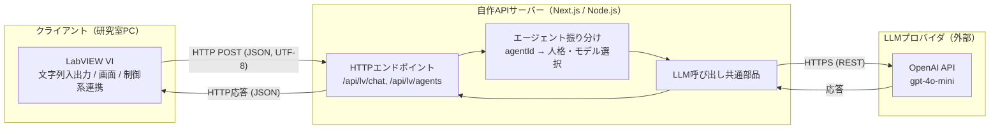
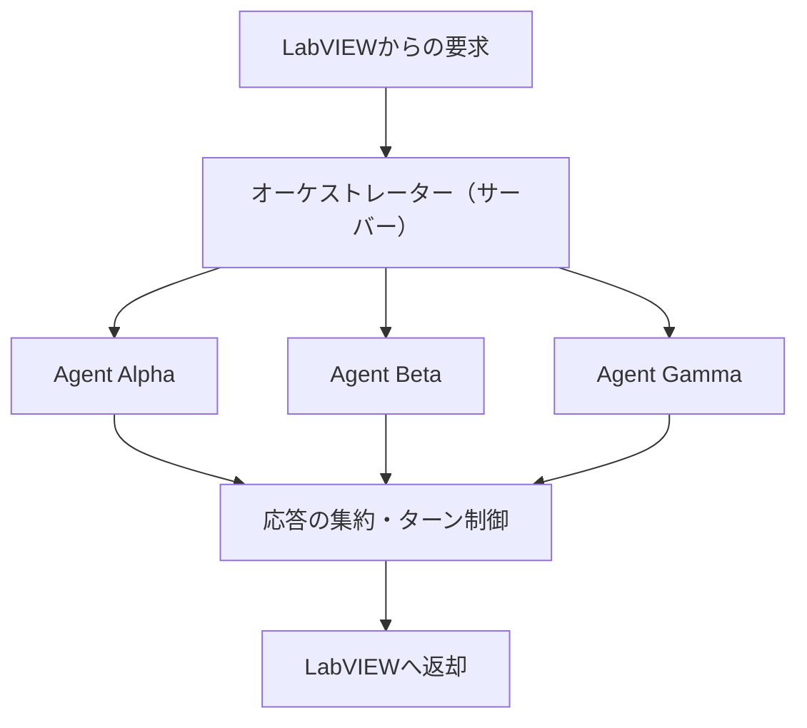
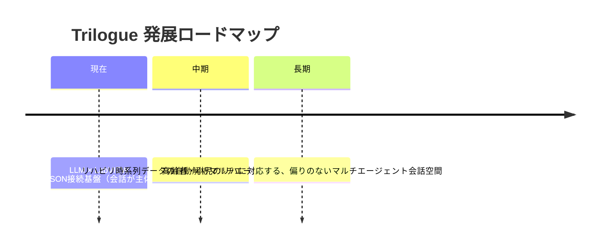

# Trilogue システム構成資料（研究室共有 / 対面討議用）

> 目的: 本システムの全体像・技術的な内訳・将来構想を、研究室内で共有し、
> 対面での議論のたたき台とするための資料。

---

## 1. 一言でいうと

**LabVIEW と LLM（大規模言語モデル）を、JSON over HTTP で接続するための基盤（インフラ）。**

LabVIEW を画面・制御の主役（クライアント）に据え、その裏で「LLMとの通信」「複数AIの振り分け」を
担当する自作のAPIサーバーを置く構成。現段階は会話が主体だが、この接続基盤がそのまま将来の
発展（時系列データ解析・マルチエージェント会話空間）の土台になる。

---

## 2. 全体構成図



- LabVIEW ⇄ サーバー: **HTTP**（同一LAN、`http://<サーバーIP>:3000`）
- サーバー ⇄ LLM: **HTTPS / REST**
- データ形式: **JSON (UTF-8)**
- APIキー: **サーバー側の環境変数のみ**で保持し、LabVIEWへは渡さない

---

## 3. 技術スタックと「自作／OSS」の内訳（重要・正確な線引き）

研究としての誠実さのため、どこが自分の実装で、どこがオープンソースかを明示する。

| レイヤ | 使用技術 | 区分 |
| --- | --- | --- |
| LabVIEW VI（クライアント） | LabVIEW 2016 標準（HTTP Client VIs / JSON VIs） | **自作VI**（標準部品を配線） |
| Webフレームワーク | Next.js（Route Handlers） | OSS（土台） |
| 言語・ランタイム | TypeScript / Node.js | OSS（土台） |
| LLM接続 | OpenAI 公式 SDK | OSS（公式ライブラリ） |
| **LV用API・振り分け・エージェント定義** | 本プロジェクトの独自コード | **自作（本研究の中核）** |

### 表現上の注意（対外的な言い方）
- ✅ 正確: 「**標準的なOSSフレームワーク（Next.js等）の上に、LabVIEW–LLM接続インフラを自作した**」
- ❌ 不正確: 「完全自作（ゼロから全部）」… HTTP基盤等はNext.jsに依存するため言い過ぎ
- ✅ 明言できる: **Dify / Flowise / LiteLLM / NextChat / OpenWebUI などの既製LLM製品は不使用**。
  Docker も現状不使用。よって「既製品を自作と偽る」問題は発生しない。

---

## 4. データフロー（リクエスト1往復の中身）

1. **LabVIEW**: ユーザー文字列を `{ "text": "...", "agentId": "alpha" }` のJSONに整形してPOST。
2. **サーバー受信**: 入力を検証。`agentId` から該当エージェントの「人格（System指示）」と「モデル」を選択。
3. **LLM呼び出し**: サーバーがAPIキーを付与し、OpenAIへHTTPSでリクエスト。
4. **整形して返却**: 応答を平坦JSON `{ ok, reply, agentId, agentName, model, error }` にしてLabVIEWへ。
5. **LabVIEW表示**: `ok` で成否分岐し、`reply` を画面表示。

> 設計の肝: LabVIEW側はステータスコード分岐をせず `ok` フラグだけで判定できるよう、
> サーバーが応答形を平坦・一定に保つ（LV側の実装を最小化）。

---

## 5. API仕様サマリ

| エンドポイント | メソッド | 役割 |
| --- | --- | --- |
| `/api/lv/chat` | POST | 対話本体。`text`（必須）, `agentId`, `history`（任意）を受け、返信を返す |
| `/api/lv/agents` | GET | エージェント一覧取得。疎通確認（ヘルスチェック）も兼ねる |
| `/api/chat` | POST | 既存Web UI用（入れ子の `messages[]` 形式） |

応答（LV用）例:
```json
{ "ok": true, "reply": "...", "agentId": "alpha", "agentName": "Alpha", "model": "gpt-4o-mini", "error": "" }
```

---

## 6. マルチエージェント化の設計方針

「複数のAIが会話する空間」へ向けた、サーバー中心の振り分け設計。

- **現状（実装済みの足場）**: `agentId`（`alpha` / `beta` / `gamma`）で、人格・モデルをサーバー側で切替。
  LabVIEW は `agentId` を変えるだけで「AIごとの差」を出せる。
- **次段階**: サーバー側で複数エージェントのターン制御（誰が・どの順で発言するか）を実装し、
  1リクエストで複数AIの応答を返す／会話を進行させる。
- **狙い**: 振り分けロジックをサーバーに集約することで、LabVIEW側は「文字列の入出力」に専念でき、
  画面・制御系の変更とAIロジックの変更を分離できる（保守性・拡張性）。



---

## 7. 研究としての位置づけとロードマップ



- **本研究の核（卒論の主軸）**: LLM と LabVIEW を JSON で接続する**インフラの構築**。
- **中期（データ蓄積後）**: リハビリで集まる**時系列データの自動解析**を、複数の専門エージェントで
  分担・統合するマルチエージェントシステムへ発展。
- **長期ビジョン**: リハビリ中の高齢者・小児への対応も含め、**特定の視点に偏らない**
  マルチエージェント会話空間の実現。
- いま会話が主体なのは、この接続基盤が**最小構成として最初に必要**だから。
  基盤がそのまま将来の解析・対話システムの土台になる。

---

## 8. 対面で議論したい論点

1. マルチエージェントの**ターン制御**をどこまでサーバーに持たせるか（進行ロジックの設計）。
2. LLMプロバイダの選定（OpenAI継続 / Gemini等の併用）と、有料枠・運用コストの方針。
3. リハビリ**時系列データ**を将来どの形式で受け渡すか（LabVIEW計測 → サーバー → 解析エージェント）。
4. 制御系・計測機器とのリンク範囲（LabVIEWの強みをどこまで活かすか）。
5. 研究室での**共有・運用形態**（サーバーをどのPCで動かすか、将来Docker化するか）。
6. 会話の**永続化／再現性**（実験としてログをどう残すか）。

---

## 9. 補足：現時点の制約（正直な整理）

- 会話履歴はサーバー側に永続化していない（文脈は都度送るステートレス方式）。
- LLM応答は外部API依存のため、レート制限・コストの監視が今後必要。
- 現状は同一LAN前提（別ネットワーク運用には公開方法の検討が必要）。
